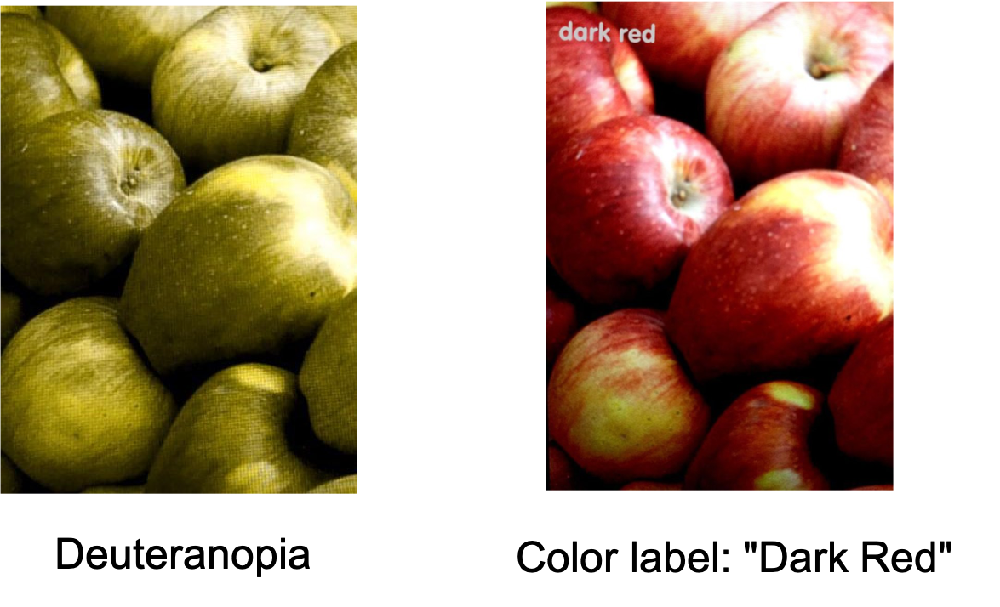

ColAR is a mobile application that supports colorblind people in daily life and provides a simulation for people with normal color vision. We provide a mobile version of the app as well as a 'limited-feature' headset version for Cardboard.

## Background
Color blindness is the decreased ability to distinguish certain colors in the human color spectrum. Red-green color blindness is the most common form, followed by blue-yellow color blindness and total color blindness. It affects approximately 1 in 12 men (8%) and 1 in 200 women (0,5%) among people with Northern European descent. Men are much more likely to be colorblind than women because the genes responsible for the most common, inherited color blindness are on the X chromosome.

There are three main deficiencies:

* Deuteranopia
* Protanopia
* Tritanopia

## Use Cases
Our application addresses two main use cases for people that suffer from color deficiency. 

###Distinguishing colors
In this modality, the user wants to distinguish between colors along the axis of color space for which they have limited discrimination. Hence, color recognition is not required.

###Color recognition and selection
In this modality, the user wants to know the normal color of an object in the scene or wants to highlight a specific user-selected color. 

####Modalities
*Simulation*: this scene allows people with normal vision to experience color deficiency.

*Correction*: this scene assists people with color deficiency while relying on following correction techniques.

## Correction Techniques
### Daltonization
Shifting of the colors in order to improve the color perception by a color-deficient viewer.
Implementation is based on the [LMS daltonization algorithm](http://www.daltonize.org/2010/05/lms-daltonization-algorithm.html). 

### ColorPopper
Pop out specific user-selected colors and suppress the brightness of all other colors. 
The implementation is based on the paper "ColourID: Improving Colour Identification for People with Impaired Colour Vision" by [Flatla et. al](https://dl.acm.org/citation.cfm?id=2702578). 

### Color Label
By using touch input, the user can get the name of the color at the touched location. The output is provided as a written label on screen.

### Magnifying lens
We provide a way for not-impaired users to understand the differences between color blind vision with and without using a certain correction technique. In Simulation mode, the user can select Magnifying glass mode and can navigate the scene using the provided lens. This feature is implemented through Vuforia markers.

## Technologies
Unity3D, C#, HLSL (OpenGL), Google Cardboard
